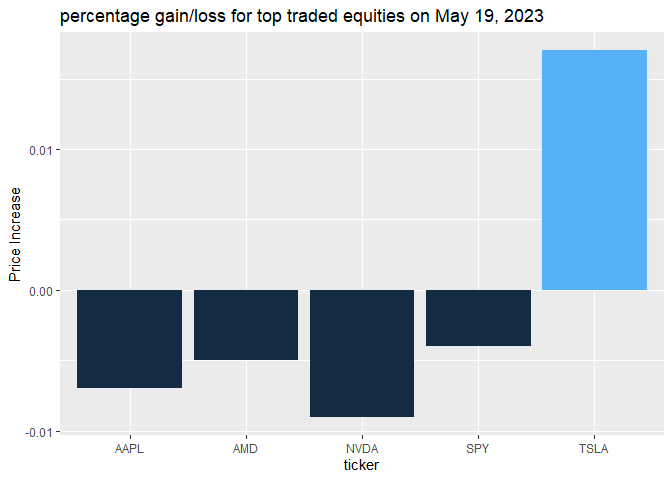

Project 1
================
Jose Singer-Freeman
2023-06-25

## I. Introduction

This project for Stat 558 consists of a vignette where I show how to
retrieve certain information from the polygon.io Market Data APIs. After
retrieving the data from the polygon.io API, I will process it and
preform a bit of exploratory data analysis.

## II. Required Packages

The packages needed to run the code to create this vignette are the
following:

- jsonlite
- httr  
- tidyverse
- ggplot2
- knitr
- scales

## III. Background

### What will we look at?

1.  First, we will retrieve price and transaction information for all
    publicly traded equities for a particular date of your choice. The
    endpoint for these data is “Aggregate (Bars)” under the Stocks API.

2.  Among these equities, we will choose the tickers with the 5 highest
    trading transactions on that date. Equities may include stocks,
    warrants, ETFs and publicly traded trusts.

3.  After finding the top 5 equities, we will retrieve price/transaction
    information for them for a period of your choice. We will also
    obtain information about the issuer behind these tickers. The
    endpoints for the price/transaction and issuer information are
    Grouped Daily (Bars) and Tickers under the Stocks API.

### What inputs will you need/be able to enter?

- The date for determining the 5-highest transacted equities
- The range of dates for the historic information on those 5 equities

### Why multiple endpoints?

The polygon.io API is designed to query all available financial
information on all equity securities for a single day or all available
financial information on a single equity security for a range of dates.
It does not have a single query to get both. Also, the issuer
information for a ticker is maintained in yet another endpoint.

## IV. Functions to Retrieve Data

`find_top_5`

This function returns the 5 equities with highest number of transactions
for a particular data, including the following information: - ticker -
volume- - weighted price - open price - close price - high price, - low
price - number of transactions - date (yyyy-mm-dd) - intra-day price
change (calculated variable) - gain (1=yes/0=no)(binary)(calculated
variable)

``` r
#get info from API

find_top_5<-function(date){
base<-'https://api.polygon.io/v2/aggs/grouped/locale/us/market/stocks/'
adjusted<-'?adjusted=true'
info_key<-'&apiKey=7FTp6uzAjKcWUI1BJEO7WppG3wyOZOy9'
API_URL<-paste0(base,date, adjusted, info_key)
daily_stock_info<-GET(API_URL)
df_daily_stock<-fromJSON(rawToChar(daily_stock_info$content))

#Re-format date/time of selected date (the format provided by the API is number of seconds since 1/1/1970) and relabel variables. 
df_daily_stock_results<-df_daily_stock$results%>%
  dplyr::mutate(date=as.POSIXct(t/1000, origin="1970-01-01"))%>%
  dplyr::rename(ticker=T, volume=v, weighted_price=vw, open_price=o, close_price=c, high_price=h, low_price=l, num_transactions=n)%>%
  select(-t)

#Pick the top 5 tickers with highest number of transactions in the chosen date 
#Also create a variable for the change in price for the day.
#Remove hours/minutes from date

top_5<-df_daily_stock_results%>%
  mutate(price_change=round(close_price/open_price-1,3), Gain=if_else(price_change>0,1,0), date=strftime(date, format="%Y-%m-%d"))%>%
  arrange(desc(num_transactions))%>%
  slice(seq(5))

return(top_5)
}
```

`get_company_info`

This function returns price/transaction information and issuer
information for the 5 top issuers for 1 day. To do so, it uses another
function `get_1_company`, which returns this information for 1 issuer .

``` r
# Function to get name of issuer, number of employees, outstanding shares for the top 5 tickers:

get_1_company<-function(xyz){
  #generate URL for the API for 1 ticker
  ticker<-xyz
  base<-'https://api.polygon.io/v3/reference/tickers/'
  info_key<-'?apiKey=7FTp6uzAjKcWUI1BJEO7WppG3wyOZOy9'
  API_URL<-paste0(base,ticker,info_key)
  #connect to API
  ticker_info<-GET(API_URL)
  #Convert retrieved information (JSON format) to an R list 
  df_ticker<-fromJSON(rawToChar(ticker_info$content))

  #Form a vector from the various variables for the 1 ticker 
df_tick_result<-cbind(
  ticker=df_ticker$results$ticker_root,
  company=df_ticker$results$name,
  outstanding=df_ticker$results$share_class_shares_outstanding,
  employees=as.numeric(df_ticker$results$total_employees))
return(df_tick_result)
}

get_company_info<-function(top_5){

#create vector with top 5 ticker names
top_5_tickers<-top_5$ticker
  
#Initialize dataframe that will store information for 5 companies 
df_ticker_res<-data.frame()

#loop through the 5 tickers to invoke the function that obtains the issuer information for each ticker

for (i in 1:5){
  oo<-data.frame(get_1_company(top_5_tickers[i]))
  df_ticker_res<-dplyr::bind_rows(df_ticker_res, oo)
  }


##MERGE the financial information with issuer information
top_5_all<-left_join(top_5,df_ticker_res, by="ticker")%>%mutate(market_cap=as.numeric(outstanding)*weighted_price/1000000000)
#replace employees=NULL with 0s
top_5_all$employees[is.na(top_5_all$employees)] <- 0

return(top_5_all)
}
```

``` r
#HISTORICAL INFO FOR EACH EQUITY
#Function to obtain prices and transactions for one ticker for a period of several days from the Polygon API


# Get info from API

get_daily_info<-function(tick, daterange){
base<-'https://api.polygon.io/v2/aggs/ticker/'
ticker<-tick
range<-'/range/1/day/'
dates<-daterange
adjusted<-'?adjusted=true&sort=asc&limit=120'
info_key<-'&apiKey=7FTp6uzAjKcWUI1BJEO7WppG3wyOZOy9'
API_URL<-paste0(base,ticker, range, dates, adjusted, info_key)
aggr_ticker_info<-GET(API_URL)
df_ticker_aggr<-fromJSON(rawToChar(aggr_ticker_info$content))

df_aggr_ticker_results<-as_tibble(df_ticker_aggr$results)%>%
  mutate(ticker=df_ticker_aggr$ticker)
return(list(df_aggr_ticker_results))
}

#Function to  obtain the daily info for each of the 5 top equities by invoking get_daily_info function above. 

get_history<-function(daterange, top_5_tickers){
  
#initialize data frame
df_daily<-data.frame(v=integer(),
                     vw=double(),
                     o=double(),
                     c=double(),
                     h=double(),
                     l=double(),
                     n=double(),
                     t=double())

for (i in 1:5){
  oo<-data.frame(get_daily_info(top_5_tickers[i], daterange))
  df_daily<-dplyr::bind_rows(df_daily, oo)
    }

df_daily<-df_daily%>%
  dplyr::rename(volume=v, weighted_price=vw, open_price=o, close_price=c, high_price=h, low_price=l, num_transactions=n)%>%
  dplyr::mutate(date=as.POSIXct(t/1000, origin="1970-01-01"),price_change=scales::percent(round(close_price/open_price-1,3)))%>% 
  dplyr::select(-t)%>%
  dplyr::relocate(ticker)

return(df_daily)

}
```

`wrapper` This function calls the other functions and yields two data
sets: one for the initial date (financial and issuer information) and
another for the range of dates ( financial information only)

``` r
wrapper<-function(x, y){
top_5<-find_top_5(x)
top_5_all<-get_company_info(top_5)
top_5_tickers<-top_5$ticker
df_daily<-get_history(y, top_5_tickers)
return(list(top_5_all, df_daily))
}

#CALL THE WRAPPER FUNCTION.  
#USER -  PLEASE PROVIDE THE DATE AND DATE RANGE

date<-'2023-05-19'
daterange<-'2023-01-01/2023-05-01'

h<-wrapper(date, daterange )
top_5_all<-h[[1]]
df_daily<-h[[2]]
```

## Exploratory Data Analysis

The top 5 most traded equity securities on January 01, 2023 are:

| ticker | issuer/equity            | outstanding shares (\$bn) | number of employees |
|:-------|:-------------------------|--------------------------:|:--------------------|
| AAPL   | Apple Inc.               |                     15.73 | 164,000             |
| AMD    | Advanced Micro Devices   |                      1.61 | 25,000              |
| NVDA   | Nvidia Corp              |                      2.47 | 26,196              |
| SPY    | SPDR S&P 500 ETF Trust   |                      0.93 | 0                   |
| TSLA   | Tesla, Inc. Common Stock |                      3.17 | 127,855             |

<!-- -->

<!-- -->

<!-- -->

<!-- -->
